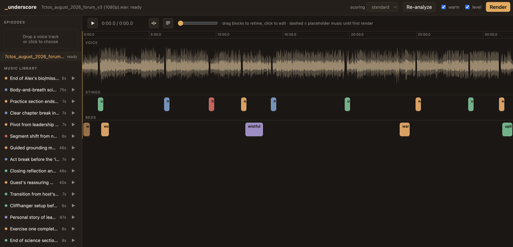

# underscore

Score a podcast voice track with music, automatically — then fine-tune it in a
DAW-style web editor.



*Underscore* (n.): music played beneath dialogue or narration. Give this tool a
voice recording and it finds the moments that deserve music, the way a radio
producer would:

1. **Whisper** transcribes locally with word-level timestamps.
2. **Claude** reads the transcript as a producer and writes a cue sheet —
   short **stings** that open a pause at act breaks and theme transitions, and
   quiet **beds** ducked under emotional or scene-setting passages.
3. **ElevenLabs** generates each piece of music from the cue's mood and scene
   description (or built-in synth pads if you have no key). Every clip lands in
   a local library and gets reused across episodes — free, and sonically
   consistent.
4. A numpy **mixer** assembles everything (pauses spliced in, beds ducked
   under speech) and ffmpeg masters to −16 LUFS.

The web UI shows your episode as three lanes — voice waveform, stings, beds —
with draggable mood-colored clips, in-browser preview, a synced transcript
panel, undo, and one-click render.

## Requirements

- **macOS on Apple Silicon** (transcription uses [mlx-whisper]). Everything
  else is portable; on other platforms the package installs but tracks can't
  be ingested.
- **ffmpeg** — `brew install ffmpeg`
- **[uv](https://docs.astral.sh/uv/)** — `brew install uv`

[mlx-whisper]: https://github.com/ml-explore/mlx-examples

## Quickstart

```sh
git clone https://github.com/etdebruin/underscore
cd underscore
uv sync

# API keys go in .env (gitignored) or your environment
cat > .env <<EOF
ANTHROPIC_API_KEY=sk-ant-...        # required: cue-sheet analysis
ELEVENLABS_API_KEY=sk_...           # optional: generated music (else synth pads)
EOF

uv run underscore-web               # opens http://127.0.0.1:8765
```

Drop a voice track on the sidebar. It transcribes, gets a cue sheet from
Claude, and opens on the timeline. Edit (drag blocks, press Space on a block to
audition its clip, ⌘Z to undo), then hit **Render** and download the MP3.

Both entry points print a note at startup for anything missing (ffmpeg, keys),
so a misconfigured setup tells you what's wrong before you hit it.

### Keys

| Variable | Needed for | Without it |
|---|---|---|
| `ANTHROPIC_API_KEY` | Claude writing the cue sheet | Analysis fails (transcribe/mix still work with a hand-written `cues.json`) |
| `ELEVENLABS_API_KEY` | Generated music | Falls back to built-in synth pads |

`.env` in the project directory is loaded automatically; real environment
variables take precedence. The Anthropic SDK also accepts credentials from
`ant auth login`.

## CLI

The pipeline also runs headless:

```sh
uv run python -m underscore.cli voice.wav -o scored.mp3 \
  --scoring rich --save-cues cues.json

# edit cues.json by hand, re-render without another Claude call:
uv run python -m underscore.cli voice.wav -o scored.mp3 --cues cues.json
```

Flags: `--scoring light|standard|rich` (sting density at theme transitions),
`--music elevenlabs|synth`, `--no-warm` / `--no-level` (voice EQ and leveling).

## Where things live

Everything is plain files you can inspect and edit:

- `~/.underscore/projects/<id>/` — per-episode: source audio, `transcript.json`,
  `cues.json`, `scored.mp3`
- `~/.underscore/library/` — every generated music clip plus a JSON sidecar
  (mood, the scene it was composed for). The analyzer sees this catalog and
  reuses clips by id.

## Example

No recording handy? Synthesize a narration from the included story:

```sh
say -v Samantha -r 165 -o voice.aiff -f examples/the-lighthouse.txt
ffmpeg -i voice.aiff -ar 44100 voice.wav
```

## Development

```sh
uv sync
uv run pytest
uv run ruff check .
```

## License

MIT
